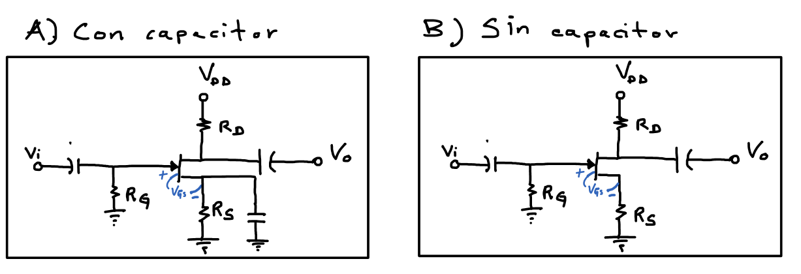
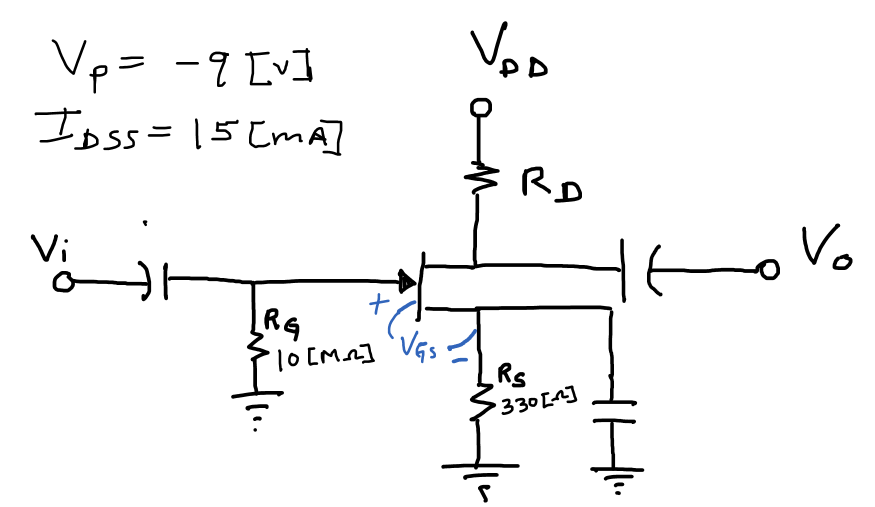
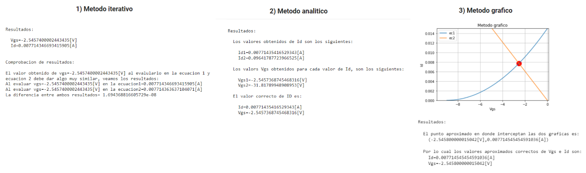
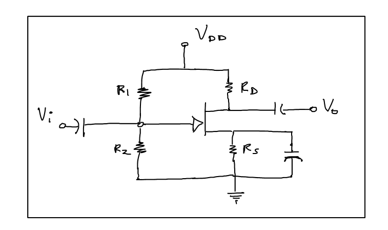
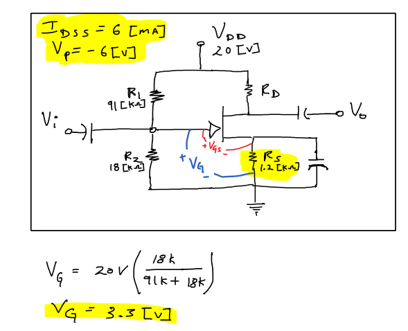
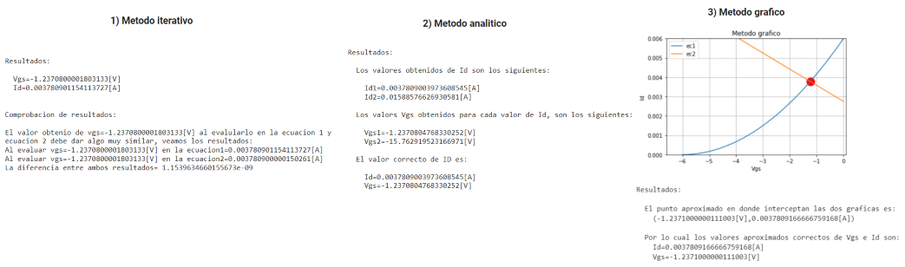
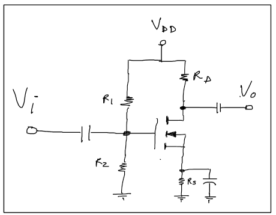
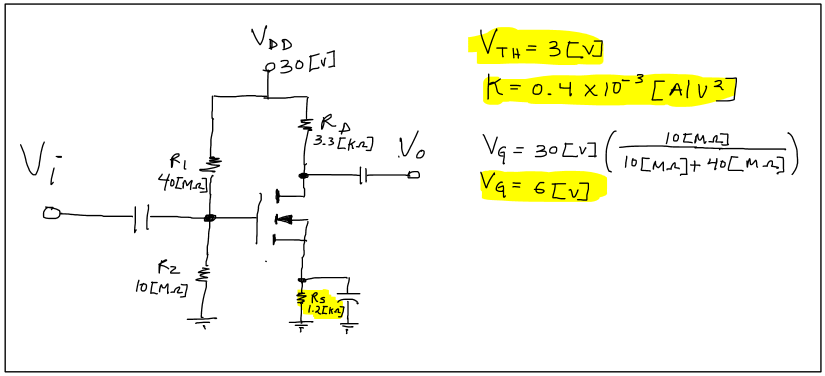
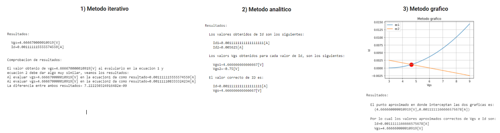
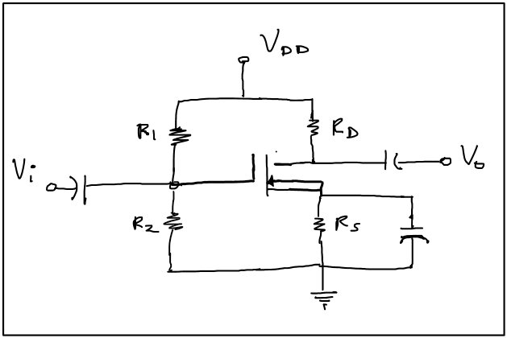

## **Obtencion del punto Q para transistores FET en diferentes polarizaciones**
#### Autor: David Roni Hernández Beltrán

El repositorio sirve para hayar el punto de operacion Q de un transistor FET, sin embargo dado que existen diferentes tipos de transistores FET y diferentes polarizaciones que se pueden hacer en cada uno de ellos, el camino para hayar su punto de operacion Q puede variar ligeramente dependiendo del tipo de transistor FET y la polarizacion que tiene, esa es la  razon por la que este repositorio contiene mas de una archivo jupyter, ya que cada archivo jupyter corresponde a la obtención del punto de operacion Q pero de un  transistor en particular con una polarizacion en particular.

Hasta es momento el repositorio cuenta con los siguientes archivos:

* JFET_canalN_autopolarizacion.ipynb
* JFET_canalN_divisionVoltaje.ipnyb
* MOSFETincremental_canalN_divisionVoltaje.ipnyb
* MOSFETdecremental_canalN_divisionVoltaje.ipnyb

### **Si quieres leer en que consiste cada uno de ellos puedes dar clic sobre su respectivo link:**

* [JFET_canalN_autopolarizacion.ipynb](#1-explicacion-del-contenido-del-archivo-jfet-canaln-autopolarizacionipynb)
* [JFET_canalN_divisionVoltaje.ipnyb](#2-explicacion-del-contenido-del-archivo-jfet-canaln-divisionvoltajeipnyb)
* [MOSFETincremental_canalN_divisionVoltaje.ipnyb](#3-explicacion-del-contenido-del-archivo-mosfetincremental-canaln-divisionvoltajeipnyb)
* [MOSFETdecremental_canalN_divisionVoltaje.ipnyb](#4-explicacion-del-contenido-del-archivo-mosfetdecremental-canaln-divisionvoltajeipnyb)

### **Video de youtube que explica como usar los jupyter:**

### **1) Explicacion del contenido del archivo: 'JFET canalN autopolarizacion.ipynb'**

[Regresar](#si-quieres-leer-en-que-consiste-cada-uno-de-ellos-puedes-dar-clic-sobre-su-respectivo-link)

En el jupyter cuyo nombre es: **'JFET_canalN_autopolarizacion.ipynb'** se obtiene 
el punto de operacion Q de un transistor: **JFET de canal N** polarizado con: **autopolarzacion**.

En la imagen siguiente podra apreciarse dos transistores: **JFET de canal N** polarizados con: **autopolarzacion**,la
unica diferencia entre los dos transistores radica en el capacitor que se encuentra a la altura de la resistencia RS, sin embargo para la obtención del punto de operación Q no importa si dicho capacitor esta o no a la altura de la resistencia RS

Es importante mencionar que en el archivo: **'JFET_canalN_autopolarizacion.ipynb'** se obtuvo el punto de operación de 3 formas distintas.
* Realizando muchas iteraciones.
* Resolviendo la ecuación de segundo grado.
* Graficando y obteniendo el punto en donde interceptan las graficas.

A continuación se presenta un ejemplo de como obtener el punto de operación a traves de dicho jupyter:

* Ejemplo:
    * Supongamos que se tiene un transistor JFET de canal N polarizado con: **'autopolarizacion'**, con los siguientes datos:
        * Idss=15[mA]
        * Vp=-9[V]
        * Rs=330[Ω]

     Y se desea hayar el su punto de operación Q con ayuda de este archivo  ¿Como se deberia hacer? 

     

     
     

     * **Obteniendo el punto de operacion Q con el metodo iterativo:** 

        Para obtener el punto de operación a travez metodo iterativo, unicamente debera irse a la casilla respetiva y sustituir los datos.

        

        
        

     * **Obteniendo el punto de operacion Q con el metodo analitico:**

        Para obtener el punto de operación a travez del metodo analitico primero debera ejecutarse la casilla que contiene la programación respetiva para resolver ecuaciones de segundo grado, y despues ya podran llenarse los datos de la casilla que obtiene el punto de operación Q atravez del metoo analitico:

        

        
        

     * **Obteniendo el punto de operacion Q con el metodo grafico:**

         Para obtener el punto de operación a travez metodo iterativo, unicamente debera irse a la casilla respetiva y sustituir los datos.

        

        
        

     * **Observación:**

         Como se puede observar los tres metodos nos dieron resultados casi identicos, sin embargo yo recomiendo que al que mas se le haga caso es al metodo analitico, ya que es el mas exacto, sin embargo se pueden ejecutar los otros dos para comprobar el resultado y obtener la grafica para que se vea mas ilustrativo la obtención del punto Q.

         

        
        

### **2) Explicacion del contenido del archivo: 'JFET canalN divisionVoltaje.ipnyb'**

[Regresar](#si-quieres-leer-en-que-consiste-cada-uno-de-ellos-puedes-dar-clic-sobre-su-respectivo-link)

En el jupyter cuyo nombre es: **'JFET_canalN_divisionVoltaje.ipnyb'** se obtiene 
el punto de operacion Q de un transistor: **JFET de canal N** polarizado con: **división de voltaje**.

En la imagen siguiente podra apreciarse un transistor: **JFET de canal N** polarizado con: **división de voltaje**

Es importante mencionar que en el archivo: **'JFET_canalN_divisionVoltaje.ipnyb'** se obtuvo el punto de operación de 3 formas distintas.
* Realizando muchas iteraciones.
* Resolviendo la ecuación de segundo grado.
* Graficando y obteniendo el punto en donde interceptan las graficas.

A continuación se presenta un ejemplo de como obtener el punto de operación a traves de dicho jupyter:

* **Ejemplo:**
   * Supongamos que se tiene un transistor JFET de canal N polarizado con: **'autopolarizacion'**, con los siguientes datos:

      * Idss=6[mA]
      * Vp=-6[V]
      * RS=1200[Ω]
      * VG=3.3[V]
    
      Y se desea hayar el su punto de operación Q con ayuda de este archivo  ¿Como se deberia hacer? 

      

      
      

      * **Obteniendo el punto de operacion Q con el metodo iterativo:** 

         Para obtener el punto de operación a travez metodo iterativo, unicamente debera irse a la casilla respectiva y sustituir los datos y posteriormente ejecutar dicha casilla.

         

         
         

      * **Obteniendo el punto de operacion Q con el metodo analitico:**

         Para obtener el punto de operación a travez del metodo analitico primero debera ejecutarse la casilla que contiene la programación respetiva para resolver ecuaciones de segundo grado, y despues ya podran llenarse los datos de la casilla que obtiene el punto de operación Q atravez del metodo analitico y posteriormente ejecutar
         dicha casilla

         

         
         

      * **Obteniendo el punto de operacion Q con el metodo grafico:**

         Para obtener el punto de operación a travez metodo iterativo, unicamente debera irse a la casilla respectiva y sustituir los datos.

         

         
         

      * **Observación:**

         Como se puede observar los tres metodos nos dieron resultados casi identicos, sin embargo yo recomiendo que al que mas se le haga caso es al metodo analitico, ya que es el mas exacto, sin embargo se pueden ejecutar los otros dos para comprobar el resultado y obtener la grafica para que se vea mas ilustrativo la obtención del punto Q.

         

         
         

### **3) Explicacion del contenido del archivo: 'MOSFETincremental canalN divisionVoltaje.ipnyb'**

[Regresar](#si-quieres-leer-en-que-consiste-cada-uno-de-ellos-puedes-dar-clic-sobre-su-respectivo-link)

En el jupyter cuyo nombre es: **'MOSFETincremental_canalN_divisionVoltaje.ipnyb'** se obtiene 
el punto de operacion Q de un transistor: **Mosfet incremental de canal N** polarizado con: **división de voltaje**.

En la imagen siguiente podra apreciarse un transistor: **Mosfet incremental de canal N** polarizado con: **división de voltaje**

Es importante mencionar que en el archivo: **'MOSFETincremental_canalN_divisionVoltaje.ipnyb'** se obtuvo el punto de operación de 3 formas distintas.
* Realizando muchas iteraciones.
* Resolviendo la ecuación de segundo grado.
* Graficando y obteniendo el punto en donde interceptan las graficas.

**Observación muy importante a considerar:** En el jupyter los valores de $I_{D_{ON}}$ y  $V_{GS_{ON}}$ son opccionales de poner sin embargo son muy importantes para que el metodo iterativo y grafico funcionen, asi que si no cuentas con dichos valores, recomiendo solo usar el metodo analitico, ya que es probable que los otros dos metodos fallen ya que utilizan como limites los valores: $I_{D_{ON}}$ y  $V_{GS_{ON}}$.

A continuación se presenta un ejemplo de como obtener el punto de operación a traves de dicho jupyter:

* **Ejemplo:**
   * Supongamos que se tiene un transistor Mosfet incremental de canal N polarizado con: **'división de voltaje'**, con los siguientes datos:

      * VTH=3[V]
      * K=0.0004[A/V^2]
      * VG=6[V]
      * RS=1200[Ω]
    
      Y se desea hayar el su punto de operación Q con ayuda de este archivo  ¿Como se deberia hacer? 

      

      
      

      * **Obteniendo el punto de operacion Q con el metodo iterativo:** 

         Para obtener el punto de operación a travez metodo iterativo, unicamente debera irse a la casilla respectiva y sustituir los datos y posteriormente ejecutar dicha casilla.

         **Observación: Solo recomiendo usar este metodo si se cuentan con los valores de: $I_{D_{ON}}$ y  $V_{GS_{ON}}$ ya que si no se cuentan con dichos datos el metodo puede fallar.Para este ejemplo el metodo iterativo obtuvo el punto de operación exitosamente a pesar de que no se contaban con los valores de:$I_{D_{ON}}$ y  $V_{GS_{ON}}$, sin embargo pudo fallar.** 

         

         
         

      * **Obteniendo el punto de operacion Q con el metodo analitico:**

         Para obtener el punto de operación a travez del metodo analitico primero debera ejecutarse la casilla que contiene la programación respectiva para resolver ecuaciones de segundo grado, y despues ya podran llenarse los datos de la casilla que obtiene el punto de operación Q atravez del metodo analitico y posteriormente ejecutar dicha casilla

         

         
         

      * **Obteniendo el punto de operacion Q con el metodo grafico:**

         Para obtener el punto de operación a travez metodo iterativo, unicamente debera irse a la casilla respectiva y sustituir los datos.

         **Observación: Solo recomiendo usar este metodo si se cuentan con los valores de: $I_{D_{ON}}$ y  $V_{GS_{ON}}$ ya que si no se cuentan con dichos datos el metodo puede fallar.Para este ejemplo el metodo grafico obtuvo el punto de operación exitosamente a pesar de que no se contaban con los valores de:$I_{D_{ON}}$ y  $V_{GS_{ON}}$, sin embargo pudo fallar.** 

         

         
         

      * **Observación:**

         Como se puede observar los tres metodos nos dieron resultados casi identicos, sin embargo yo recomiendo  mas al metodo analitico, y lo recomiendo aun mas, cuando NO SE CUENTE CON los valores de: $I_{D_{ON}}$ y $V_{GS_{ON}}$ y solo se cuente con el valor de $K$, ya que si no se cuentan con los valores $I_{D_{ON}}$ y  $V_{GS_{ON}}$, los otros metodos(iterativo,grafico) pueden fallar.
         Para este ejemplo en particular los 3 metodos obtuvieron el punto de operación de forma exitosa, sin embargo como no se contaba con el valor de $I_{D_{ON}}$ y  $V_{GS_{ON}}$ pudieron fallar el metodo iterativo y grafico, aunque para este ejemplo no fallaron.

         

         
         

### **4) Explicacion del contenido del archivo: 'MOSFETdecremental canalN divisionVoltaje.ipnyb'**

[Regresar](#si-quieres-leer-en-que-consiste-cada-uno-de-ellos-puedes-dar-clic-sobre-su-respectivo-link)

En el jupyter cuyo nombre es: **'MOSFETdecremental_canalN_divisionVoltaje.ipnyb'** se obtiene 
el punto de operacion Q de un transistor: **Mosfet decremental de canal N** polarizado con: **división de voltaje**.

En la imagen siguiente podra apreciarse un transistor: **Mosfet decremental de canal N** polarizado con: **división de voltaje**

Es importante recordar que los transistores JFET tienen casi el mismo comportamiento que los transistores MOSFET decrementales, la unica diferencia es que los  los transistores MOSFET decrementales pueden dar corrientes mas grandes que $I_{DSS}$ y los transistores JFET no pueden hacer eso por que si no se queman.

Es importante mencionar que en el archivo: **'MOSFETincremental_canalN_divisionVoltaje.ipnyb'** se obtuvo el punto de operación de 1 sola forma:

* Resolviendo la ecuación de segundo grado.

* **Ejemplo:**
   * Supongamos que se tiene un transistor MOSFET decremental de canal N polarizado con: **'división de voltaje'**, con los siguientes datos:

      * Idss=10[mA]
      * Vp=-8[V]
      * RS=1000[Ω]
      * VG=16[V]
    
      Y se desea hayar el su punto de operación Q con ayuda de este archivo  ¿Como se deberia hacer? 

      

      
      

      * **Obteniendo el punto de operacion Q con el metodo analitico:**

         Para obtener el punto de operación a travez del metodo analitico primero debera ejecutarse la casilla que contiene la programación respectiva para resolver ecuaciones de segundo grado, y despues ya podran llenarse los datos de la casilla que obtiene el punto de operación Q atravez del metodo analitico y posteriormente ejecutar dicha casilla

         

         
         
